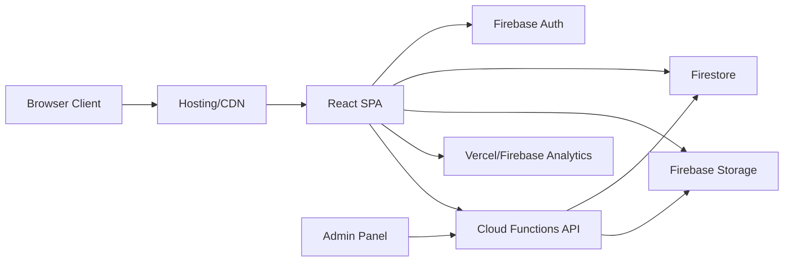
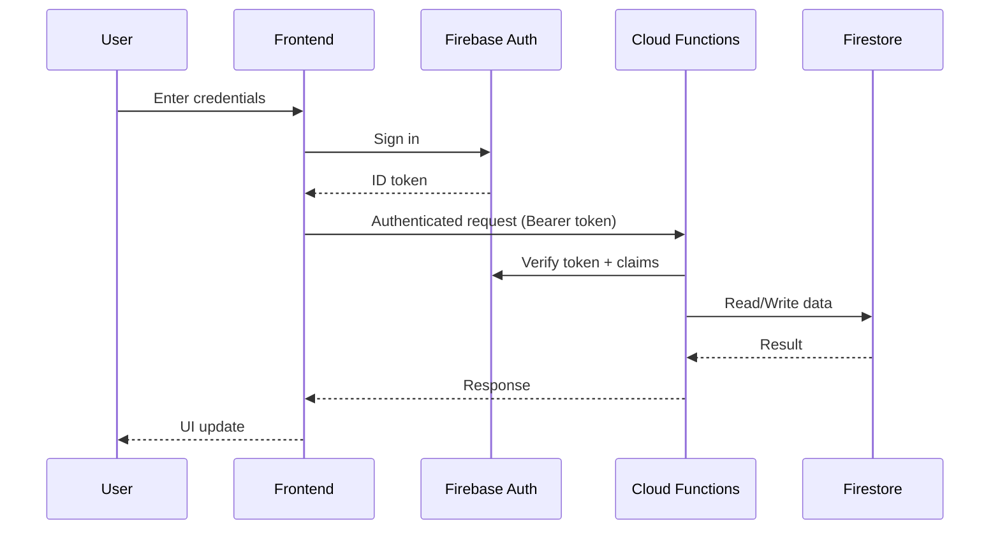
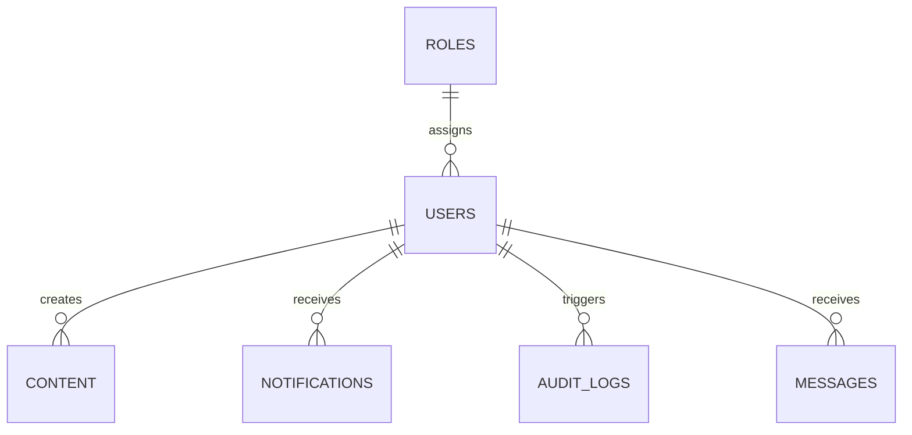

# WebBuzz Tech

Production Technical Documentation

This document describes the enterprise-level architecture, modules, and operational practices for the WebBuzz Tech platform. The current repository contains the production frontend and Firebase configuration; backend services are described as the standard production stack for this platform.

## Table of Contents

- [1. Project Overview](#1-project-overview)
- [2. Features](#2-features)
- [3. System Architecture](#3-system-architecture)
- [4. Frontend Documentation](#4-frontend-documentation)
- [5. Backend Documentation](#5-backend-documentation)
- [6. Database Design](#6-database-design)
- [7. API Documentation](#7-api-documentation)
- [8. User Workflow](#8-user-workflow)
- [9. Admin Panel Documentation](#9-admin-panel-documentation)
- [10. Security Features](#10-security-features)
- [11. Deployment Guide](#11-deployment-guide)
- [12. Installation Guide](#12-installation-guide)
- [13. Future Enhancements](#13-future-enhancements)
- [14. Conclusion](#14-conclusion)

## 1. Project Overview

### What the project is
WebBuzz Tech is a production-ready digital platform and agency operations suite that combines a high-performance public website with enterprise workflows for client intake, content delivery, analytics, and administrative management.

### Purpose of the platform
- Present a premium, conversion-focused marketing presence.
- Capture qualified leads and route them into internal workflows.
- Provide internal teams with dashboards for content, users, and performance.
- Enable operational automation through analytics and notifications.

### Problems it solves
- Fragmented client inquiries and manual lead handling.
- Lack of visibility into engagement and conversion performance.
- Inconsistent content publishing and approval processes.
- Limited operational control for admins and managers.

### Target users
- Prospective clients evaluating services.
- Internal sales and delivery teams.
- Admin users managing content, users, and analytics.
- Executive stakeholders monitoring KPIs.

## 2. Features

### Core platform features
- User authentication and secure session handling.
- Client and team dashboards for operational insights.
- Admin panel for platform governance.
- User management with role-based access control.
- Content management and publishing workflows.
- Analytics dashboards for traffic, conversions, and engagement.
- Notifications (in-app and email) for workflow events.
- Search functionality across content and users.

### Public site features (current production frontend)
- Single-page, high-performance landing experience.
- Section-based navigation with smooth scrolling.
- Contact intake form integrated with Firestore.
- Accessibility-first motion handling and contrast-safe color system.
- Responsive layout with optimized media assets.

## 3. System Architecture

### Architecture overview
- **Frontend:** React + Vite single-page application with Tailwind CSS.
- **Backend:** Serverless services (Firebase Authentication, Firestore, Cloud Functions).
- **Database:** Firestore (document database).
- **APIs:** HTTPS Cloud Functions and Firebase SDK.
- **Authentication Flow:** Firebase Auth with ID tokens and custom claims for roles.
- **File Storage:** Firebase Storage for media and uploads.

### High-level architecture diagram



### Authentication and data flow (sequence)



## 4. Frontend Documentation

### Technology stack
- React 19
- Vite 7
- Tailwind CSS 3
- Framer Motion (animation)
- Firebase SDK (Firestore, Analytics)
- Vercel Analytics

### Folder structure (current repository)

```
src/
  assets/
    optimized/
  components/
    About.jsx
    ContactForm.jsx
    ContactInfo.jsx
    Footer.jsx
    Hero.jsx
    Navbar.jsx
    Services.jsx
    Testimonials.jsx
    Toast.jsx
  utils/
    accessibleColors.js
    animations.js
    heroHeightAdjust.js
    reducedMotion.js
    scrollUtils.js
  App.jsx
  App.css
  firebase.js
  index.css
  main.jsx
```

### Components
- **Navbar:** Section navigation with scroll-spy and mobile menu.
- **Hero:** Primary landing message, CTA, and motion-driven visuals.
- **About / Services / Testimonials:** Content sections with motion and SEO hints.
- **ContactInfo:** Contact channels and social media links.
- **ContactForm:** Lead intake with validation and Firestore submission.
- **Toast:** Global notification system (context-based).
- **Footer:** Quick links, contact details, and branding.

### Pages
- Single-page application with semantic sections (no client router).

### Routing
- Anchor-based section navigation using `react-scroll` and custom scroll utilities.

### State management
- React hooks for local component state.
- Context provider for toast notifications.
- Derived state for UI (animations, scroll position).

### API integration
- Firestore writes for contact intake (`messages` collection).
- Firebase Analytics initialization in the browser.

### Responsive design
- Tailwind utility classes with mobile-first breakpoints.
- Motion reduced for users with `prefers-reduced-motion`.
- Adaptive hero height for short viewports.

## 5. Backend Documentation

### Technology stack
- Firebase Authentication (identity)
- Firestore (database)
- Cloud Functions (API layer)
- Firebase Storage (file assets)

### Server structure (recommended for Cloud Functions)

```
functions/
  src/
    index.ts
    config/
      env.ts
    controllers/
      authController.ts
      contentController.ts
      userController.ts
    middleware/
      auth.ts
      rbac.ts
      validate.ts
      rateLimit.ts
    routes/
      authRoutes.ts
      contentRoutes.ts
      userRoutes.ts
    services/
      firestoreService.ts
      storageService.ts
      notificationService.ts
  package.json
  tsconfig.json
```

### Controllers
- Encapsulate business logic for authentication, content, and admin workflows.

### Routes
- REST-style routes exposed through HTTPS functions.

### Middleware
- Authentication token validation.
- Role-based authorization checks.
- Input validation and rate limiting.

### Authentication
- Firebase Auth for user identities.
- ID tokens used as JWTs for API authentication.
- Custom claims for roles and permissions.

### Authorization
- RBAC policy enforcement in middleware.
- Firestore rules for data-level access control.

### Database connection
- Firebase Admin SDK for server-side Firestore access.

### Error handling
- Standardized error responses (code, message, trace id).
- Central error handler for consistent logging.

### Security implementation
- Strict CORS allowlist.
- Input validation on all write endpoints.
- Audit logs for admin actions.

## 6. Database Design

### Database overview
Firestore is used as the primary document database. It supports high-scale reads, fine-grained security rules, and real-time updates.

### Core collections
- `messages` (implemented): lead submissions from the contact form.
- `users`: platform users and profile data.
- `roles`: role definitions and permission sets.
- `content`: content items, assets, and publish status.
- `notifications`: in-app notifications.
- `audit_logs`: admin actions and compliance trail.

### Relationships
- `users.roleId -> roles.id`
- `content.ownerId -> users.id`
- `notifications.userId -> users.id`
- `audit_logs.actorId -> users.id`

### ER diagram (conceptual)



### Schema examples

**messages**
```json
{
  "id": "auto",
  "name": "Jane Doe",
  "email": "jane@example.com",
  "phone": "+1-555-0100",
  "service": "webDev",
  "message": "Looking for a redesign.",
  "createdAt": "serverTimestamp"
}
```

**users**
```json
{
  "id": "uid_123",
  "displayName": "Admin User",
  "email": "admin@webbuzz.tech",
  "roleId": "role_admin",
  "status": "active",
  "createdAt": "2026-06-03T10:00:00Z"
}
```

**content**
```json
{
  "id": "content_001",
  "title": "Case Study: Retail Growth",
  "slug": "retail-growth",
  "status": "published",
  "ownerId": "uid_123",
  "tags": ["case-study", "retail"],
  "publishedAt": "2026-06-03T10:00:00Z"
}
```

## 7. API Documentation

The API layer is exposed via HTTPS Cloud Functions. Endpoints follow a versioned path: `/api/v1/*`.

### Auth API

#### POST /api/v1/auth/login

| Field | Value |
| --- | --- |
| Endpoint | `/api/v1/auth/login` |
| Method | POST |
| Authentication | Public |
| Request Body | `email`, `password` |
| Response | `token`, `refreshToken`, `user` |
| Example Request | See below |
| Example Response | See below |

**Example Request**
```json
{
  "email": "admin@webbuzz.tech",
  "password": "StrongPassword!"
}
```

**Example Response**
```json
{
  "token": "eyJhbGci...",
  "refreshToken": "eyJhbGci...",
  "user": {
    "id": "uid_123",
    "displayName": "Admin User",
    "role": "admin"
  }
}
```

#### POST /api/v1/auth/logout

| Field | Value |
| --- | --- |
| Endpoint | `/api/v1/auth/logout` |
| Method | POST |
| Authentication | User |
| Request Body | `refreshToken` |
| Response | `success` |
| Example Request | See below |
| Example Response | See below |

**Example Request**
```json
{
  "refreshToken": "eyJhbGci..."
}
```

**Example Response**
```json
{
  "success": true
}
```

### User Management API

#### GET /api/v1/users

| Field | Value |
| --- | --- |
| Endpoint | `/api/v1/users` |
| Method | GET |
| Authentication | Admin |
| Request Body | None |
| Response | `users[]` |
| Example Request | See below |
| Example Response | See below |

**Example Request**
```json
{
  "query": "?page=1&limit=20"
}
```

**Example Response**
```json
{
  "users": [
    {
      "id": "uid_123",
      "displayName": "Admin User",
      "email": "admin@webbuzz.tech",
      "role": "admin",
      "status": "active"
    }
  ]
}
```

#### PATCH /api/v1/users/{id}

| Field | Value |
| --- | --- |
| Endpoint | `/api/v1/users/{id}` |
| Method | PATCH |
| Authentication | Admin |
| Request Body | `role`, `status` |
| Response | `user` |
| Example Request | See below |
| Example Response | See below |

**Example Request**
```json
{
  "role": "editor",
  "status": "active"
}
```

**Example Response**
```json
{
  "id": "uid_456",
  "displayName": "Content Editor",
  "role": "editor",
  "status": "active"
}
```

### Content Management API

#### POST /api/v1/content

| Field | Value |
| --- | --- |
| Endpoint | `/api/v1/content` |
| Method | POST |
| Authentication | Editor, Admin |
| Request Body | `title`, `body`, `tags` |
| Response | `content` |
| Example Request | See below |
| Example Response | See below |

**Example Request**
```json
{
  "title": "WebBuzz Case Study",
  "body": "...",
  "tags": ["case-study", "growth"]
}
```

**Example Response**
```json
{
  "id": "content_001",
  "status": "draft",
  "ownerId": "uid_123"
}
```

#### PATCH /api/v1/content/{id}/publish

| Field | Value |
| --- | --- |
| Endpoint | `/api/v1/content/{id}/publish` |
| Method | PATCH |
| Authentication | Admin |
| Request Body | `publishedAt` |
| Response | `content` |
| Example Request | See below |
| Example Response | See below |

**Example Request**
```json
{
  "publishedAt": "2026-06-03T10:00:00Z"
}
```

**Example Response**
```json
{
  "id": "content_001",
  "status": "published",
  "publishedAt": "2026-06-03T10:00:00Z"
}
```

### Messages API

#### POST /api/v1/messages

| Field | Value |
| --- | --- |
| Endpoint | `/api/v1/messages` |
| Method | POST |
| Authentication | Public |
| Request Body | `name`, `email`, `message`, `service` |
| Response | `messageId` |
| Example Request | See below |
| Example Response | See below |

**Example Request**
```json
{
  "name": "Jane Doe",
  "email": "jane@example.com",
  "service": "webDev",
  "message": "Looking for a redesign."
}
```

**Example Response**
```json
{
  "messageId": "msg_123"
}
```

### Analytics API

#### GET /api/v1/analytics/summary

| Field | Value |
| --- | --- |
| Endpoint | `/api/v1/analytics/summary` |
| Method | GET |
| Authentication | Admin |
| Request Body | None |
| Response | `kpis` |
| Example Request | See below |
| Example Response | See below |

**Example Request**
```json
{
  "query": "?range=30d"
}
```

**Example Response**
```json
{
  "kpis": {
    "visits": 12000,
    "leads": 340,
    "conversionRate": 2.83
  }
}
```

### Notification API

#### POST /api/v1/notifications

| Field | Value |
| --- | --- |
| Endpoint | `/api/v1/notifications` |
| Method | POST |
| Authentication | Admin |
| Request Body | `userId`, `title`, `message` |
| Response | `notificationId` |
| Example Request | See below |
| Example Response | See below |

**Example Request**
```json
{
  "userId": "uid_123",
  "title": "New Lead",
  "message": "A new lead has submitted the contact form."
}
```

**Example Response**
```json
{
  "notificationId": "notif_001"
}
```

### Search API

#### GET /api/v1/search

| Field | Value |
| --- | --- |
| Endpoint | `/api/v1/search` |
| Method | GET |
| Authentication | User |
| Request Body | None |
| Response | `results[]` |
| Example Request | See below |
| Example Response | See below |

**Example Request**
```json
{
  "query": "?q=case+study&type=content"
}
```

**Example Response**
```json
{
  "results": [
    {
      "id": "content_001",
      "title": "Case Study: Retail Growth",
      "type": "content"
    }
  ]
}
```

## 8. User Workflow

### Registration flow
1. User submits registration form.
2. Firebase Auth creates the user.
3. Default role assigned via custom claims.
4. User profile stored in Firestore.

### Login flow
1. User submits credentials.
2. Firebase Auth issues ID token.
3. Token attached to API calls.
4. Client session established.

### Dashboard flow
1. User accesses dashboard.
2. API returns role-scoped data.
3. UI renders analytics and assigned tasks.

### Admin workflow
1. Admin signs in.
2. Admin views user/content queues.
3. Admin publishes content and updates user roles.
4. Actions recorded to audit logs.

### Content publishing workflow
1. Editor drafts content.
2. Admin reviews and publishes.
3. Notifications sent to stakeholders.

## 9. Admin Panel Documentation

### Admin features
- User provisioning and deactivation.
- Role and permission management.
- Content review, approval, and scheduling.
- Analytics dashboards and KPI tracking.
- System settings and integrations.

### User control
- View users, roles, and status.
- Disable accounts and reset access.

### Content control
- Draft, review, approve, publish.
- Tagging and SEO metadata.

### Analytics
- Traffic, conversion, and lead metrics.
- Channel performance reports.

### Settings
- Organization profile.
- Notification templates.
- Security policies.

## 10. Security Features

- JWT-based authentication via Firebase ID tokens.
- Password hashing handled by the authentication provider.
- Role-based access control (RBAC) with custom claims.
- Rate limiting on critical endpoints.
- Input validation and schema enforcement.
- XSS protection via React output escaping and sanitization.
- CSRF protection for state-changing requests (token or same-site strategy).

## 11. Deployment Guide

### Frontend deployment

**Vercel**
1. Set build command: `npm run build`.
2. Set output directory: `dist`.
3. Configure environment variables (see below).

**Firebase Hosting**
1. Run `npm run build`.
2. Deploy with `firebase deploy --only hosting`.

### Backend deployment
1. Implement Cloud Functions in the `functions/` codebase.
2. Deploy with `firebase deploy --only functions`.

### Environment variables
Set the following in your deployment environment:

```
VITE_FIREBASE_API_KEY=
VITE_FIREBASE_AUTH_DOMAIN=
VITE_FIREBASE_PROJECT_ID=
VITE_FIREBASE_STORAGE_BUCKET=
VITE_FIREBASE_MESSAGING_SENDER_ID=
VITE_FIREBASE_APP_ID=
VITE_FIREBASE_MEASUREMENT_ID=
```

### Production setup
- Enable Firestore rules and indexes.
- Configure domain and SSL.
- Enable analytics providers.
- Configure cache headers in hosting (see firebase.json).

### CI/CD workflow
- Lint and test on pull requests.
- Build on main branch and deploy to hosting.
- Deploy functions after successful build.

## 12. Installation Guide

### Prerequisites
- Node.js 18+ (20+ recommended)
- npm 9+
- Firebase CLI (if deploying hosting/functions)

### Clone repository
```
git clone <repo-url>
cd WebBuzz
```

### Install dependencies
```
npm install
```

### Run frontend
```
npm run dev
```

### Run backend (Cloud Functions)
```
cd functions
npm install
npm run serve
```

### Environment configuration
Create a `.env` file with the required `VITE_FIREBASE_*` values.

## 13. Future Enhancements

- Dedicated admin dashboard application.
- Advanced CRM and lead scoring.
- Full-text search integration.
- Multi-tenant organization support.
- Automated reporting and alerting.
- A/B testing and experimentation framework.

## 14. Conclusion

WebBuzz Tech is engineered to deliver a premium public experience and a scalable enterprise platform for internal operations. The architecture supports growth, performance, and compliance while keeping the developer experience clean and maintainable.
